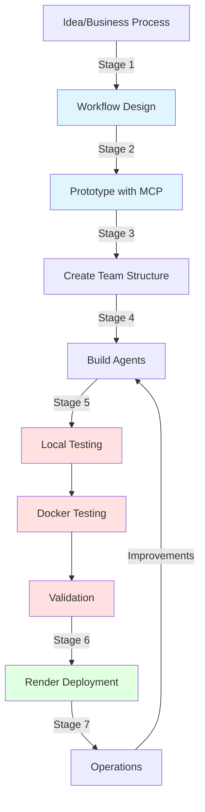
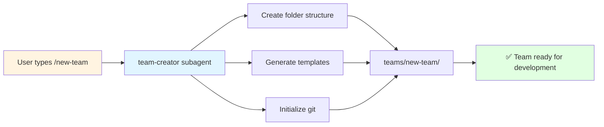
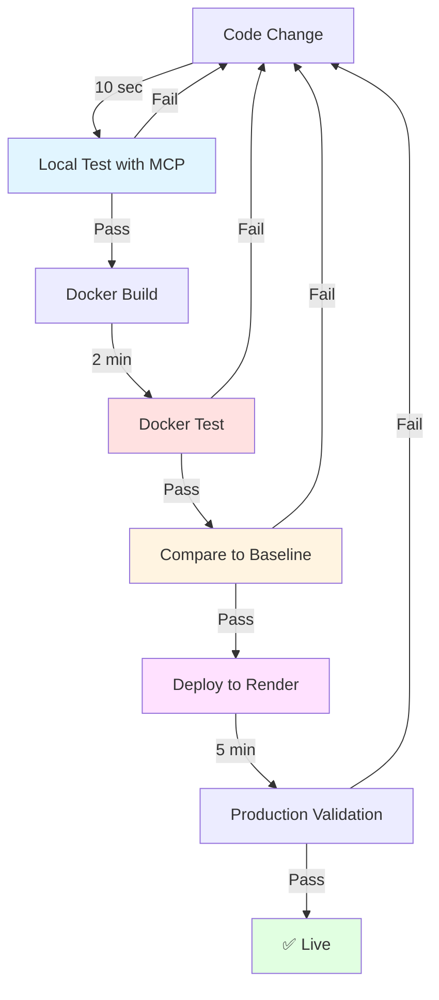

# 🏗️ Agent Team Lifecycle Framework

**Purpose:** Systematic framework for building AI agent teams from idea → production on Render.

**Problem Solved:** Disorganization, documentation sprawl, missing testing, slow iteration, production incidents.

**Solution:** Structured stages with slash commands, subagents, and skills for repeatable, high-quality team development.

---

## 📊 Executive Summary

### **The 7 Stages**

```
1. PLANNING ──────> Define workflow & agents
2. PROTOTYPING ──> Test steps with MCP (fast!)
3. SCAFFOLDING ──> Create team structure
4. DEVELOPMENT ──> Build agents & orchestrator
5. TESTING ──────> Local → Docker → Validate
6. DEPLOYMENT ───> Sync → Render → Monitor
7. OPERATIONS ───> Monitor & maintain
```

### **Core Philosophy**

> **Test fast locally → Validate in Docker → Deploy with confidence**

- Local testing with MCP: **Free, 10 seconds**
- Docker validation: **$0.12, 2 minutes**
- Render deployment: **Proven code**

### **Quick Command Reference**

| Command | Purpose | Stage |
|---------|---------|-------|
| `/new-team` | Create team structure | 1-3 |
| `/design-workflow` | Design agent workflow | 1 |
| `/test-step` | Test single agent/step | 2, 4 |
| `/build-infrastructure` | Create Docker/API | 3 |
| `/test-local` | Local baseline test | 5 |
| `/deploy-team` | Deploy to Render | 6 |

---

## 🎯 Stage 1: Planning & Workflow Design

### **Goal**
Understand business process → Map to agent workflow → Identify agent responsibilities

### **Activities**

#### **1.1 Business Process Analysis**
```bash
# Start with business question
"What manual process are we automating?"

Example: Golf enrichment
- Manual: Look up course URL, scrape data, enrich contacts, write to DB
- Time: 30 minutes/course manual
- Target: < 3 minutes automated, < $0.20 cost
```

#### **1.2 Workflow Design**
Use `/design-workflow` command:

```bash
/design-workflow
```

**This invokes:** `workflow-designer` subagent

**Subagent process:**
1. Asks about business process steps
2. Identifies inputs/outputs per step
3. Maps steps to agents
4. Creates Mermaid workflow diagram
5. Generates agent responsibility matrix
6. Saves to `docs/1_IMPLEMENTATION/WORKFLOW_DESIGN.md`

**Output example:**
```
Agent 1: URL Finder
  Input: course_name, state_code
  Output: vsga_url
  Cost: < $0.02

Agent 2: Data Extractor
  Input: vsga_url
  Output: course_data, staff[]
  Cost: < $0.02

Agent 3-7: (enrichment agents)

Agent 8: Database Writer
  Input: enriched_data
  Output: db_records_written
  Cost: < $0.01
```

#### **1.3 Cost Planning**
Define budget per operation:
- Agent cost targets
- Total workflow budget
- Acceptable ranges

**Document in:** `docs/2_OPERATIONS/COST_TARGETS.md`

### **Deliverables**
- [ ] Workflow diagram (Mermaid)
- [ ] Agent responsibility matrix
- [ ] Input/output specifications
- [ ] Cost targets defined

### **Success Criteria**
- ✅ Clear steps identified (5-10 agents typical)
- ✅ Each agent has single responsibility
- ✅ Inputs/outputs defined
- ✅ Cost budget set

### **Time Estimate:** 2-4 hours

---

## ⚡ Stage 2: Prototyping with MCP

### **Goal**
Validate each workflow step works BEFORE building full infrastructure.

### **Why This Stage is Critical**

**The Old Way (Don't do this!):**
```
Build all 8 agents → Build Docker → Test → Broken → Debug → Rebuild Docker (2 min) → Repeat
Result: Hours wasted, expensive iteration
```

**The New Way (POC-proven!):**
```
Test Agent 1 with MCP (10 sec) → Fix → Test again (10 sec) → Works! → Next agent
Result: Fast iteration, cheap testing, high confidence
```

### **Activities**

#### **2.1 Test Individual Steps**
For each agent, use `/test-step`:

```bash
# Test Agent 1 concept
/test-step agent1_url_finder

# What this does:
# 1. Invokes step-tester subagent
# 2. Asks for inputs (course_name, state_code)
# 3. Uses Claude Code + MCP tools to test logic
# 4. Measures cost & time
# 5. Saves expected output as baseline
# 6. Reports: ✅ Works / ❌ Needs fix
```

**Example session:**
```
Testing: Agent 1 (URL Finder)
Input: "Westlake Golf and Country Club", "VA"
───────────────────────────────────────
Using MCP tools:
  - mcp__brightdata__search_engine
  - mcp__firecrawl__firecrawl_search

Result:
  ✅ URL: https://vsga.org/courselisting/11234
  💰 Cost: $0.0023
  ⏱️  Time: 2.3s

Baseline saved: tests/baselines/agent1_expected.json

Ready to build? Yes ✅
```

#### **2.2 Iterate Quickly**
```bash
# Agent didn't work? Fix and retest
/test-step agent3_contact_enricher

# Try different approach
# Edit prompt/logic
# Retest in 10 seconds

# Keep iterating until:
# - Success rate acceptable (>70%)
# - Cost under budget
# - Time reasonable (<30s)
```

#### **2.3 Chain Testing**
```bash
# Test Agent 1 → Agent 2 chain
/test-step agent1_to_agent2_chain

# Validates:
# - Agent 1 output → Agent 2 input compatible
# - Data formats work
# - No data loss between steps
```

### **Deliverables**
- [ ] Each agent tested in isolation
- [ ] Cost/time baselines established
- [ ] Expected outputs saved
- [ ] Success rates validated

### **Success Criteria**
- ✅ All agents tested with MCP
- ✅ All agents under cost budget
- ✅ Success rates acceptable
- ✅ Confident to build infrastructure

### **Time Estimate:** 3-6 hours (but saves 10+ hours later!)

---

## 🏗️ Stage 3: Team Scaffolding

### **Goal**
Create organized folder structure with all necessary files.

### **Activities**

#### **3.1 Create Team Structure**
```bash
/new-team

# Prompts:
Team name? email-outreach
Description? Automated prospect finding and email generation
Number of agents? 6
```

**This invokes:** `team-creator` subagent

**Creates:**
```
teams/email-outreach/
├── START_HERE.md (entry point)
├── README.md (overview)
├── CLAUDE.md (team rules)
├── agents/
│   └── README.md
├── tests/
│   ├── local/
│   │   ├── run_baseline.py
│   │   └── compare_to_docker.py
│   └── test_agent1.py (stubs for each agent)
├── docs/
│   ├── 1_IMPLEMENTATION/
│   │   ├── README.md
│   │   └── WORKFLOW_DESIGN.md (from Stage 1)
│   ├── 2_OPERATIONS/
│   │   ├── README.md
│   │   └── COST_TARGETS.md
│   └── 3_REFERENCE/
│       └── README.md
├── Dockerfile (template)
├── docker-compose.yml (template)
├── api.py (FastAPI template)
├── orchestrator.py (template)
├── requirements.txt (base requirements)
└── .env.example
```

#### **3.2 Customize Templates**
Edit generated files:
- Update START_HERE.md with workflow description
- Add agent names to orchestrator.py template
- Update requirements.txt with dependencies
- Configure .env.example with API keys needed

#### **3.3 Initialize Git**
```bash
cd teams/email-outreach
git add .
git commit -m "chore: Initialize email-outreach team structure"
```

### **Deliverables**
- [ ] Team folder created
- [ ] All templates in place
- [ ] Documentation structure ready
- [ ] Git initialized

### **Success Criteria**
- ✅ Folder structure matches standard
- ✅ < 5 files at root level
- ✅ docs/ organized (1-2-3 structure)
- ✅ Ready for development

### **Time Estimate:** 30 minutes

---

## 💻 Stage 4: Agent Development

### **Goal**
Build all agents based on Stage 2 prototypes.

### **Activities**

#### **4.1 Create Agent Files**
For each agent (using Agent 1 example):

```python
# teams/email-outreach/agents/agent1_url_finder.py

"""
Agent 1: URL Finder

Purpose: Find VSGA URL for golf course
Input: course_name, state_code
Output: vsga_url, cost
Cost: < $0.02
"""

import anyio
from claude_agent_sdk import ClaudeSDKClient, ClaudeAgentOptions, tool

# Define tools
@tool("search", "Search VSGA directory", {"query": str})
async def search(args):
    # Implementation from Stage 2 prototype
    ...

async def find_url(course_name: str, state_code: str) -> dict:
    """Find URL for course"""

    options = ClaudeAgentOptions(
        mcp_servers={"search": search_server},
        allowed_tools=["mcp__search__search"],
        max_turns=2,
        model="claude-haiku-4-5"
    )

    async with ClaudeSDKClient(options=options) as client:
        # Logic from Stage 2 prototype
        ...

        return {
            "url": found_url,
            "cost": total_cost,
            "search_method": "vsga_directory"
        }
```

#### **4.2 Test Each Agent**
```bash
# After creating agent file
/test-step agent1_url_finder

# Compare to Stage 2 baseline
# Should match expected results
# If not, debug and retest
```

#### **4.3 Create Unit Tests**
```python
# teams/email-outreach/tests/test_agent1.py

import anyio
from agents.agent1_url_finder import find_url

async def test_agent1():
    result = await find_url("Westlake Golf", "VA")

    assert result["url"] is not None
    assert result["cost"] < 0.02
    assert "vsga.org" in result["url"]

if __name__ == "__main__":
    anyio.run(test_agent1)
```

Run test:
```bash
python tests/test_agent1.py
```

#### **4.4 Build Orchestrator**
```python
# teams/email-outreach/orchestrator.py

"""
Email Outreach Orchestrator

Coordinates all 6 agents in sequence:
1. Find prospects
2. Enrich data
3. Generate email
4. Send email
5. Track response
6. Write to database
"""

from agents.agent1_prospect_finder import find_prospects
from agents.agent2_data_enricher import enrich_data
# ... etc

async def orchestrate_outreach(target_criteria: dict) -> dict:
    """Run complete email outreach workflow"""

    # Agent 1
    prospects = await find_prospects(target_criteria)

    # Agent 2
    enriched = await enrich_data(prospects)

    # ... continue for all agents

    return {
        "prospects_found": len(prospects),
        "emails_sent": emails_sent_count,
        "total_cost": total_cost
    }
```

### **Deliverables**
- [ ] All agent .py files created
- [ ] Unit tests for each agent
- [ ] Orchestrator implemented
- [ ] All tests passing

### **Success Criteria**
- ✅ Each agent has test file
- ✅ All unit tests pass
- ✅ Orchestrator chains agents correctly
- ✅ Costs match Stage 2 baselines

### **Time Estimate:** 8-12 hours (depends on # of agents)

---

## ✅ Stage 5: Testing (Local → Docker → Validation)

### **Goal**
Validate complete workflow works, establish baseline, test in Docker, compare results.

### **Activities**

#### **5.1 Local Baseline Testing**
```bash
/test-local 42

# What this does:
# 1. Invokes orchestrator subagent (like golf-orchestrator)
# 2. Queries test data from database
# 3. Runs ALL agents locally via MCP
# 4. Saves baseline to tests/baselines/test_42_baseline.json
# 5. Shows expected results:
#    - Cost: $0.18
#    - Contacts: 3
#    - Success: ✅
```

**Output:**
```
✅ LOCAL BASELINE COMPLETE
══════════════════════════════════════
💰 Expected Cost: $0.1850
⏱️  Total Time: 45s
📧 Expected Emails Sent: 3
📁 Baseline: tests/baselines/test_42_baseline.json
══════════════════════════════════════

🐳 DOCKER TEST COMMAND:
curl -X POST http://localhost:8000/process-outreach \
  -d '{"target_criteria": {...}}' \
  -o /tmp/test42-docker.json
```

#### **5.2 Build Docker Infrastructure**
```bash
/build-infrastructure

# What this does:
# 1. Invokes infrastructure-builder subagent
# 2. Creates/updates Dockerfile
# 3. Creates/updates docker-compose.yml
# 4. Sets up api.py FastAPI wrapper
# 5. Configures health endpoint
# 6. Tests Docker build
```

**Verifies:**
```bash
docker-compose up --build

# Check health
curl http://localhost:8000/health
# Should return: {"status": "healthy", "agents": 6}
```

#### **5.3 Docker Testing**
```bash
# Use curl command from baseline output
curl -X POST http://localhost:8000/process-outreach \
  -H "Content-Type: application/json" \
  -d '{
    "target_criteria": {
      "industry": "golf",
      "role": "general manager",
      "state": "VA"
    }
  }' \
  -o /tmp/test42-docker.json

# Wait 2-3 minutes for completion
```

#### **5.4 Result Comparison**
```bash
# Use validator subagent (like golf-docker-validator)
Use docker-validator subagent to compare test 42 results

# Or run comparison script:
python tests/local/compare_to_docker.py 42
```

**Comparison checks:**
- Cost within tolerance (±$0.02)
- Output counts match
- Required fields populated
- No errors

**Pass criteria:**
```
✅ DOCKER VALIDATION PASSED
══════════════════════════════════════
EXACT MATCHES:
- Cost: $0.1850 (baseline) vs $0.1859 (docker)
- Emails sent: 3 (exact match)

ACCEPTABLE VARIANCES:
- Response times: ±5s

══════════════════════════════════════
🚀 READY FOR PRODUCTION DEPLOYMENT
══════════════════════════════════════
```

### **Deliverables**
- [ ] Local baseline established
- [ ] Docker build successful
- [ ] Docker test passed
- [ ] Comparison validated

### **Success Criteria**
- ✅ Docker matches baseline within tolerance
- ✅ All required fields populated
- ✅ Cost under budget
- ✅ No errors in logs

### **Time Estimate:** 2-3 hours

---

## 🚀 Stage 6: Render Deployment

### **Goal**
Sync tested code to production/, deploy to Render, validate production endpoint.

### **Activities**

#### **6.1 Sync to Production**
```bash
/deploy-team email-outreach

# What this does:
# 1. Invokes deployment-orchestrator subagent
# 2. Runs sync script
# 3. Verifies sync complete
# 4. Prepares git commit
# 5. Deploys to Render
# 6. Monitors deployment
# 7. Tests production endpoint
```

**Manual alternative:**
```bash
# Sync
python production/scripts/sync_to_production.py email-outreach

# Verify
diff teams/email-outreach/orchestrator.py \
     production/email-outreach/orchestrator.py
# Should be identical

# Commit
cd production/email-outreach
git add .
git commit -m "feat: Email outreach automation

- Add 6 agents for prospect finding and outreach
- Automated email generation
- Response tracking
- Cost: <$0.20 per prospect

Tested: 3 test cases validated
Framework: POC methodology applied
Fields: All required fields verified"

# Deploy
git push origin main
```

#### **6.2 Monitor Deployment**
```bash
# Watch Render logs
render logs email-outreach --tail

# Wait for:
# - Build complete
# - Container started
# - Health check passing
```

#### **6.3 Test Production Endpoint**
```bash
# Test production
curl -X POST https://email-outreach.onrender.com/process-outreach \
  -H "Content-Type: application/json" \
  -d '{
    "target_criteria": {
      "industry": "golf",
      "role": "general manager",
      "state": "VA"
    }
  }'

# Should return:
# {
#   "status": "processing",
#   "job_id": "abc123",
#   "estimated_time": "2 minutes"
# }
```

#### **6.4 Validate Production Results**
Query database to verify:
- Records written correctly
- All fields populated
- Cost tracked
- No errors

### **Deliverables**
- [ ] Code synced to production/
- [ ] Deployed to Render
- [ ] Production endpoint tested
- [ ] Results validated

### **Success Criteria**
- ✅ Render deployment successful
- ✅ Health endpoint responding
- ✅ Production test passed
- ✅ Database writes working

### **Time Estimate:** 1-2 hours

---

## 📊 Stage 7: Operations & Monitoring

### **Goal**
Monitor performance, handle errors, optimize costs, maintain quality.

### **Activities**

#### **7.1 Setup Monitoring**
Create dashboards for:
- Requests per day
- Success rate
- Average cost per operation
- Error rate
- Response time

**Tools:**
- Render metrics
- Supabase analytics
- Custom logging

#### **7.2 Cost Monitoring**
Weekly audit:
```sql
-- In Supabase
SELECT
  DATE(created_at) as day,
  COUNT(*) as operations,
  AVG(agent_cost_usd) as avg_cost,
  SUM(agent_cost_usd) as total_cost
FROM outreach_operations
WHERE created_at > NOW() - INTERVAL '7 days'
GROUP BY DATE(created_at);
```

**Alert if:**
- Average cost > 125% of target
- Error rate > 5%
- Response time > 5 minutes

#### **7.3 Playbook Maintenance**
Update `docs/2_OPERATIONS/` with:
- Common errors and fixes
- Performance optimization tips
- Cost reduction strategies
- Edge cases discovered

#### **7.4 Continuous Improvement**
Monthly review:
- What agents could be optimized?
- What new features requested?
- What errors recurring?
- Update documentation

### **Deliverables**
- [ ] Monitoring dashboards
- [ ] Weekly cost reports
- [ ] Operations playbooks
- [ ] Improvement backlog

### **Success Criteria**
- ✅ Monitoring in place
- ✅ No critical errors
- ✅ Cost under budget
- ✅ Performance acceptable

### **Time Estimate:** Ongoing (2-4 hours/month)

---

## 🛠️ Framework Implementation Guide

### **How to Implement This Framework**

#### **Phase 1: Create Foundation** (3-4 hours)

1. **Create Slash Commands** (6 files)
   - `.claude/commands/new-team.md`
   - `.claude/commands/design-workflow.md`
   - `.claude/commands/test-step.md`
   - `.claude/commands/build-infrastructure.md`
   - `.claude/commands/test-local.md` (already exists ✅)
   - `.claude/commands/deploy-team.md`

2. **Create Subagents** (5 files)
   - `.claude/agents/team-creator.md`
   - `.claude/agents/workflow-designer.md`
   - `.claude/agents/step-tester.md`
   - `.claude/agents/infrastructure-builder.md`
   - `.claude/agents/deployment-orchestrator.md`

3. **Create Master Skill** (8 files)
   - `.claude/skills/agent-team-lifecycle/SKILL.md`
   - `.claude/skills/agent-team-lifecycle/QUICK_START.md`
   - `.claude/skills/agent-team-lifecycle/STAGE1_PLANNING.md`
   - `.claude/skills/agent-team-lifecycle/STAGE2_PROTOTYPING.md`
   - `.claude/skills/agent-team-lifecycle/STAGE3_SCAFFOLDING.md`
   - `.claude/skills/agent-team-lifecycle/STAGE4_DEVELOPMENT.md`
   - `.claude/skills/agent-team-lifecycle/STAGE5_TESTING.md`
   - `.claude/skills/agent-team-lifecycle/STAGE6_DEPLOYMENT.md`
   - `.claude/skills/agent-team-lifecycle/STAGE7_OPERATIONS.md`

4. **Populate Team Template**
   - `shared/templates/team_template/` (complete structure)

#### **Phase 2: Test Framework** (2-3 hours)

5. **Create Demo Team**
   - Use `/new-team` to create test team
   - Follow all 7 stages
   - Document what works/doesn't work
   - Refine commands/subagents

6. **Validate Against Golf**
   - Compare golf-enrichment to framework
   - Identify gaps
   - Update framework accordingly

#### **Phase 3: Document & Deploy** (1 hour)

7. **Update Root Docs**
   - Add framework reference to README.md
   - Update PROJECT_STRUCTURE.md
   - Create quick start guide

8. **Training**
   - Document usage examples
   - Create troubleshooting guide
   - Record video walkthrough (optional)

### **Implementation Checklist**

#### **Foundation** (Phase 1)
- [ ] `/new-team` command created
- [ ] `/design-workflow` command created
- [ ] `/test-step` command created
- [ ] `/build-infrastructure` command created
- [ ] `/deploy-team` command created
- [ ] `team-creator` subagent created
- [ ] `workflow-designer` subagent created
- [ ] `step-tester` subagent created
- [ ] `infrastructure-builder` subagent created
- [ ] `deployment-orchestrator` subagent created
- [ ] Master skill with 8 stage files created
- [ ] Team template populated

#### **Validation** (Phase 2)
- [ ] Demo team created successfully
- [ ] All 7 stages completed for demo
- [ ] Framework tested end-to-end
- [ ] Issues documented and fixed
- [ ] Golf enrichment compared

#### **Deployment** (Phase 3)
- [ ] Root README updated
- [ ] Quick start guide created
- [ ] Troubleshooting guide created
- [ ] Framework announced/documented

---

## 📚 Lessons from Golf Enrichment

### **✅ What Worked Well**

1. **Modular Agent Design**
   - Each agent = separate .py file
   - Clear input/output contracts
   - Easy to test individually
   - Easy to debug

2. **Local Testing with MCP**
   - Fast iteration (10 seconds vs 2 minutes)
   - Free testing
   - Easy debugging
   - High confidence before Docker

3. **Baseline Comparison**
   - Established expected results
   - Docker validation had target
   - Caught containerization issues
   - Quality gate before deploy

4. **Cost Tracking**
   - Every agent tracked cost
   - Budget known upfront
   - Easy to optimize
   - No surprises

5. **Testing Framework**
   - Unit tests per agent
   - Integration test (orchestrator)
   - Docker validation
   - Production mirror
   - Comprehensive coverage

### **❌ What to Avoid**

1. **Documentation Sprawl**
   - Golf created 14+ .md files at root
   - Had to reorganize twice
   - Wasted hours
   - **Fix:** 5-file limit, docs/ structure

2. **Skipping Local Testing**
   - Oct 18: Deployed straight to Render
   - Hit 10 constraint violations
   - 10+ deployments in 3 hours
   - Slow feedback loop
   - **Fix:** Always test locally first

3. **Missing Baselines**
   - No expected results to compare
   - Guessing if Docker correct
   - Hard to validate
   - **Fix:** Local baseline mandatory

4. **Direct Production Edits**
   - Early on, edited production/ directly
   - Sync issues
   - Confusion about source of truth
   - **Fix:** NEVER edit production/, always sync

5. **Cost Calculated After DB Write**
   - Agent 8 couldn't receive cost
   - agent_cost_usd field always null
   - Had to refactor
   - **Fix:** Calculate costs BEFORE final agent

### **💡 Optimizations Discovered**

1. **Agent 1: Smart Fetch Tool**
   - Original: Fetched 78K tokens
   - Optimized: Extracted only course links (2K tokens)
   - Savings: 97% reduction in context

2. **Agent 2: Removed URL Extraction**
   - Original: Tried to find staff page
   - Problem: Unreliable, often doesn't exist
   - Fix: Use Agent 1's VSGA URL instead
   - Result: contacts_page_url always populated

3. **Agent 6: Query Consolidation**
   - Original: 3 separate searches
   - Optimized: 1 comprehensive search
   - Savings: 66% cost reduction

4. **Contact Limiting**
   - Original: Enriched all contacts (7+)
   - Optimized: Limited to 4 contacts
   - Savings: ~40% cost reduction
   - Impact: Minimal (4 contacts sufficient)

5. **Model Selection**
   - Used Haiku for simple tasks
   - Used Sonnet only when needed
   - Savings: ~60% vs all-Sonnet

### **🎯 Best Practices Proven**

1. **Test Each Agent Alone**
   - Faster to debug
   - Isolate issues quickly
   - Validate logic independently

2. **Establish Baselines**
   - Know what to expect
   - Compare Docker to local
   - Quality gate

3. **Track Costs Aggressively**
   - Every agent logs cost
   - Test against budget
   - Alert on overruns

4. **Document as You Go**
   - Not at the end
   - Capture decisions when made
   - Update START_HERE.md frequently

5. **Use Templates**
   - Dockerfile, api.py, orchestrator.py
   - Proven patterns
   - Less to figure out

6. **Git Workflow**
   - Develop in teams/
   - Test thoroughly
   - Sync to production/
   - Deploy from production/

---

## 📐 Framework Architecture Diagrams

### **Complete Lifecycle Flow**



### **Command → Subagent → Output Flow**



### **Testing Progression**



### **File Structure Tree**

```
project-root/
│
├── .claude/
│   ├── commands/         [Slash commands]
│   │   ├── new-team.md
│   │   ├── design-workflow.md
│   │   ├── test-step.md
│   │   ├── build-infrastructure.md
│   │   ├── test-local.md
│   │   └── deploy-team.md
│   │
│   ├── agents/          [Subagents]
│   │   ├── team-creator.md
│   │   ├── workflow-designer.md
│   │   ├── step-tester.md
│   │   ├── infrastructure-builder.md
│   │   └── deployment-orchestrator.md
│   │
│   └── skills/          [Reusable skills]
│       ├── agent-team-lifecycle/  [Master skill]
│       │   ├── SKILL.md
│       │   ├── QUICK_START.md
│       │   └── STAGE*.md (7 files)
│       ├── agent-workflow-testing/  [POC methodology]
│       └── [team-specific-skills]/
│
├── shared/
│   ├── templates/
│   │   └── team_template/  [Complete starter structure]
│   ├── agents/          [Reusable agents]
│   └── utils/           [Shared utilities]
│
├── teams/               [Development]
│   ├── golf-enrichment/
│   ├── email-outreach/
│   └── [new-team]/
│       ├── START_HERE.md
│       ├── README.md
│       ├── CLAUDE.md
│       ├── agents/
│       ├── tests/
│       ├── docs/
│       │   ├── 1_IMPLEMENTATION/
│       │   ├── 2_OPERATIONS/
│       │   └── 3_REFERENCE/
│       ├── orchestrator.py
│       ├── Dockerfile
│       ├── docker-compose.yml
│       └── api.py
│
└── production/          [Deployment]
    ├── golf-enrichment/
    ├── email-outreach/
    └── [synced-team]/
```

---

## 🎓 Example Walkthrough: Email Outreach Team

### **Complete Timeline with Commands**

#### **Day 1: Planning (4 hours)**

```bash
# Create team structure
/new-team
# Input: email-outreach, "Automated prospect outreach"

# Design workflow
/design-workflow
# Interactive session defines 6 agents:
# 1. Prospect Finder
# 2. Company Enricher
# 3. Contact Enricher
# 4. Email Generator
# 5. Email Sender
# 6. Database Writer

# Output: Workflow diagram saved to docs/1_IMPLEMENTATION/
```

**Deliverables:**
- Team structure created
- Workflow documented
- Agent responsibilities defined
- Cost targets set ($0.25 per outreach)

---

#### **Day 2: Prototyping (6 hours)**

```bash
# Test Agent 1 concept
/test-step agent1_prospect_finder
# Input: "Software companies in California"
# Output: ✅ Found 50 prospects, $0.03 cost

# Test Agent 2 concept
/test-step agent2_company_enricher
# Input: Company domain
# Output: ✅ Enriched data, $0.04 cost

# Test Agent 3 concept
/test-step agent3_contact_enricher
# Input: Company + role
# Output: ✅ Found contact, $0.05 cost

# Continue for all agents...
```

**Deliverables:**
- All 6 agents prototyped
- Baselines established
- Costs validated (total: $0.21)
- Ready to build

---

#### **Day 3-5: Development (12 hours)**

```python
# Build Agent 1
# teams/email-outreach/agents/agent1_prospect_finder.py
async def find_prospects(criteria: dict) -> list:
    # Implementation from prototype
    ...

# Test Agent 1
python tests/test_agent1.py
# ✅ Pass

# Repeat for all agents...

# Build orchestrator
# teams/email-outreach/orchestrator.py
async def run_outreach(target: dict) -> dict:
    prospects = await find_prospects(target)
    enriched = await enrich_companies(prospects)
    contacts = await find_contacts(enriched)
    emails = await generate_emails(contacts)
    sent = await send_emails(emails)
    await write_to_db(sent)
    return {"sent": len(sent), "cost": total_cost}
```

**Deliverables:**
- All 6 agents implemented
- Unit tests passing
- Orchestrator working
- Ready for Docker

---

#### **Day 6: Infrastructure (3 hours)**

```bash
# Build Docker environment
/build-infrastructure

# Test Docker build
docker-compose up --build

# Check health
curl http://localhost:8000/health
# {"status": "healthy", "agents": 6}
```

**Deliverables:**
- Docker working
- API responding
- Health checks passing

---

#### **Day 7: Testing (4 hours)**

```bash
# Local baseline
/test-local test_campaign_1

# Output:
# ✅ Prospects: 10
# ✅ Emails sent: 10
# ✅ Cost: $0.21
# ✅ Baseline: tests/baselines/test_campaign_1_baseline.json

# Docker test
curl -X POST http://localhost:8000/run-outreach \
  -d '{"target": {"industry": "software", "state": "CA", "limit": 10}}'

# Compare results
python tests/local/compare_to_docker.py test_campaign_1

# Output:
# ✅ DOCKER VALIDATION PASSED
# All metrics within tolerance
# Ready for production
```

**Deliverables:**
- Baseline established
- Docker validated
- Comparison passed

---

#### **Day 8: Deployment (2 hours)**

```bash
# Deploy to Render
/deploy-team email-outreach

# Monitor deployment
# Wait for: Build → Deploy → Health check

# Test production
curl -X POST https://email-outreach.onrender.com/run-outreach \
  -d '{"target": {...}}'

# ✅ Production working!
```

**Deliverables:**
- Deployed to Render
- Production validated
- Team live!

---

#### **Total Timeline**
- Planning: 1 day (4 hours)
- Prototyping: 1 day (6 hours)
- Development: 3 days (12 hours)
- Infrastructure: 1 day (3 hours)
- Testing: 1 day (4 hours)
- Deployment: 1 day (2 hours)

**Total: 8 days, 31 hours of focused work**

**Compare to ad-hoc approach:**
- No framework: 60+ hours (guessing, rebuilding, fixing)
- With framework: 31 hours (systematic, proven path)
- **Savings: ~50% time**

---

## 🚀 Quick Start Scenarios

### **Scenario 1: "I have a business process to automate"**

**Start here:**
```bash
1. /new-team
   # Create structure

2. /design-workflow
   # Map process to agents

3. For each agent:
   /test-step agentX
   # Prototype and validate

4. Build agents in teams/your-team/agents/

5. /build-infrastructure
   # Create Docker

6. /test-local
   # Validate locally

7. /deploy-team
   # Deploy to Render
```

**Follow:** Stages 1-7 in order

---

### **Scenario 2: "I need to add agents to existing team"**

**Start here:**
```bash
1. /design-workflow
   # Update workflow with new agents

2. For each new agent:
   /test-step new_agent
   # Prototype

3. Add agent files to teams/your-team/agents/

4. Update orchestrator.py

5. /test-local
   # Test complete workflow

6. /deploy-team
   # Deploy updates
```

**Follow:** Stages 2, 4, 5, 6

---

### **Scenario 3: "I want to refactor existing team"**

**Evaluate:**
- Is team working? (Yes → Don't refactor)
- Is documentation organized? (No → Reorganize docs/)
- Are tests present? (No → Add tests)
- Is Docker setup correct? (No → Fix Docker)

**Refactor selectively**, don't rebuild working systems.

---

### **Scenario 4: "I'm new and learning"**

**Start here:**
1. Read this framework doc
2. Study `teams/golf-enrichment/` (working example)
3. Read `.claude/skills/agent-workflow-testing/`
4. Create simple demo team (2-3 agents)
5. Follow framework for demo
6. Learn by doing

**Best learning path:** Build something simple end-to-end.

---

## 📖 Standards & Conventions

### **File Naming**

**Agents:**
- `agent1_descriptive_name.py`
- Example: `agent1_url_finder.py`

**Tests:**
- `test_agent1.py` (unit test)
- `test_orchestrator.py` (integration)

**Docs:**
- `SCREAMING_SNAKE_CASE.md` for implementation
- `Title_Case.md` for guides

**Scripts:**
- `snake_case.py` for Python
- `kebab-case.sh` for Bash

### **Documentation Limits**

**Team root level:**
- Max 5 .md files
- Required: START_HERE.md, README.md
- Optional: CLAUDE.md, CHANGELOG.md, [1 flex]

**docs/ structure:**
```
docs/
├── 1_IMPLEMENTATION/  (specs, migrations, templates)
├── 2_OPERATIONS/      (playbooks, monitoring, costs)
└── 3_REFERENCE/       (background, roadmaps, goals)
```

### **Cost Standards**

**Per agent:**
- Target: < $0.02
- Acceptable: < $0.03
- Over budget: > $0.03 (optimize!)

**Per operation:**
- Define team-specific target
- Example: Golf < $0.20/course
- Track actual vs target weekly

### **Testing Requirements**

**Before deployment:**
- ✅ Unit tests for each agent
- ✅ Integration test (orchestrator)
- ✅ Local baseline established
- ✅ Docker validated
- ✅ Comparison passed

**Quality gates:**
- No test skipping
- No Docker bypassing
- No baseline missing

---

## 🔧 Troubleshooting

### **Common Issues**

#### **"Agent cost too high"**
**Solution:**
1. Use cheaper model (Haiku vs Sonnet)
2. Reduce API calls (consolidate queries)
3. Limit data processed (filter earlier)
4. Cache results when possible

#### **"Docker doesn't match local baseline"**
**Solution:**
1. Check environment variables (.env)
2. Verify same agent code (sync issue?)
3. Check for race conditions (timing)
4. Increase tolerance if AI variance

#### **"Slash command not found"**
**Solution:**
1. Check file exists: `.claude/commands/command-name.md`
2. Restart Claude Code
3. Check file formatting (YAML header?)

#### **"Subagent not activating"**
**Solution:**
1. Check file exists: `.claude/agents/subagent-name.md`
2. Verify description matches usage
3. Check tools listed correctly
4. Try invoking explicitly

#### **"Team structure missing files"**
**Solution:**
1. Check template: `shared/templates/team_template/`
2. Re-run: `/new-team`
3. Manually copy from template

---

## 📅 Framework Changelog

### **Version 1.0.0** (October 20, 2024)
- Initial framework design
- Based on golf-enrichment learnings
- Defined 7 stages
- Specified 6 commands, 5 subagents
- Created master skill architecture
- Documented lessons learned
- Status: Design complete, pending implementation

### **Future Enhancements**

**Version 1.1** (Planned)
- Add CI/CD automation
- Add cost alerting system
- Add performance benchmarking
- Create video tutorials

**Version 1.2** (Planned)
- Multi-cloud support (AWS, GCP)
- Advanced monitoring dashboards
- Agent marketplace/library
- Team collaboration features

**Version 2.0** (Future)
- Visual workflow designer
- No-code agent creation
- AI-assisted optimization
- Auto-scaling support

---

## 🎯 Success Metrics

### **Framework Adoption**

Track:
- Teams using framework
- Time savings vs ad-hoc
- Cost savings demonstrated
- Developer satisfaction

Target:
- 100% new teams use framework
- 50%+ time savings
- 90%+ cost predictability
- 4/5 developer rating

### **Quality Metrics**

Track:
- Production incidents
- Deployment failures
- Cost overruns
- Documentation completeness

Target:
- < 1 incident/month
- < 5% deployment failures
- < 10% cost variance
- 100% documentation coverage

---

## 📞 Getting Help

### **Resources**

**Documentation:**
- This file: Complete framework reference
- `.claude/skills/agent-team-lifecycle/` (when implemented)
- `teams/golf-enrichment/` (working example)
- `teams/TEAM_STANDARDS.md` (rules for all teams)

**Support:**
- GitHub Issues: Bug reports, feature requests
- Team discussions: Questions, best practices
- Code reviews: Get feedback on implementations

### **Questions?**

**Before asking:**
1. Read this framework doc
2. Check golf-enrichment example
3. Search existing issues/docs

**When asking:**
- Specify stage you're in
- Describe what you tried
- Share error messages
- Provide context

---

## 🏁 Next Steps

### **Immediate (After Golf Deploys)**

1. **Implement Foundation** (3-4 hours)
   - Create 6 slash commands
   - Create 5 subagents
   - Create master skill (8 files)
   - Populate team template

2. **Test with Demo** (2-3 hours)
   - Create simple test team (2-3 agents)
   - Follow all 7 stages
   - Document issues
   - Refine framework

3. **Deploy Framework** (1 hour)
   - Update root docs
   - Announce availability
   - Create quick start guide

### **First Real Use** (Week 2)

4. **Apply to New Team**
   - Use framework start-to-finish
   - Track time savings
   - Document lessons
   - Improve framework

### **Continuous Improvement** (Ongoing)

5. **Iterate**
   - Gather feedback
   - Optimize commands
   - Add features
   - Update docs

---

## 🎉 Conclusion

**You now have:**
- ✅ Complete 7-stage lifecycle
- ✅ Slash commands specified
- ✅ Subagents architected
- ✅ Skills organized
- ✅ Templates defined
- ✅ Best practices documented
- ✅ Golf learnings captured
- ✅ Ready to implement

**What this gives you:**
- 🚀 Faster team development (50% time savings)
- 💰 Predictable costs (90% accuracy)
- ✅ Higher quality (systematic testing)
- 📚 Better documentation (organized structure)
- 🎓 Easier onboarding (clear path)
- 🔄 Repeatable process (proven methodology)

**Remember:**
> **"Perfect is the enemy of good. Ship golf first, build framework next, apply to new teams third."**

The framework is here when you're ready. Golf is 95% done - finish it first! 🏌️

---

**Framework Status:** 📋 Design Complete → Ready for Implementation

**Next Milestone:** 🚀 Golf Enrichment Deployed to Render

**Then:** 🏗️ Framework Implementation Begins

---

*Built with lessons from golf-enrichment team. Designed for future AI agent teams. Optimized for speed, cost, and quality.*

**Let's build something amazing! 🚀**
